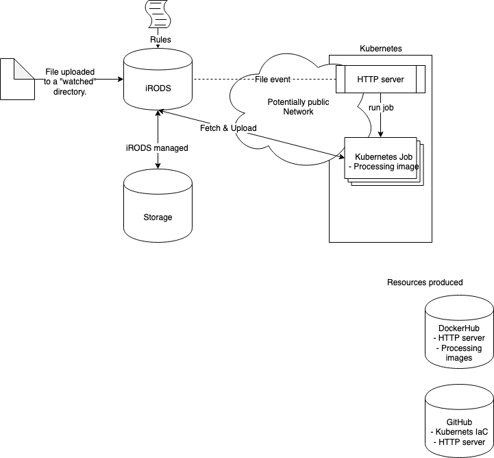

# WUR Event Driven Analysis

This project has a goal of exploring event-driven analytics for the purposes of DNA sequencing.
Data should be processed automatically, using a pre-defined pipeline, upon arrival in iRODS.

This repository contains all relevant code used to interact with a Kubernetes cluster set up temporarily at https://145.100.58.53/ 

The `k8s` directory contains all code which is used to interract with Kubernetes.

The `task_distributor` contains all code which is used as an endpoint to iRODS.
## The setup

## iRODS setup
The following test rule has been added to iRODS (add location on server).

```
pep_api_data_obj_put_post(*INSTANCE_NAME, *COMM, *DATAOBJINP, *BUFFER, *PORTAL_OPR_OUT) {

        #writeLine("serverLog","Testing testing testing")

        *username=*COMM.user_user_name
        *pathobject=*DATAOBJINP.obj_path
        writeLine("serverLog","username: *username")
        writeLine("serverLog","pathobject: *pathobject")

        if(*pathobject like "/tempZone/home/davids/testwebhook/*") {
                writeLine("serverLog","rule triggered for testwebhook")
                *Cmd="postTok8s"
                *Arg=*pathobject
                msiExecCmd(*Cmd, *Arg, "null", "null", "null", *Result);
                msiGetStdoutInExecCmdOut(*Result,*Out);
                writeLine("serverLog","Results from trigger: *Out")
        }

}
```

The rule is stored in `/etc/irods/addfileWebhook.re` and installed in `/etc/irods/server_config.json`. If this rule gets triggered and the path name is like the specified iRODS path (`/tempZone/home/davids/testwebhook` in this case), the rule launches the following curl command stored in `/var/lib/irods/msiExecCmd_bin/postTok8s`. 

```
curl -XPOST http://145.100.58.247:31162/k8s/job -H "Content-Type: application/json" -d '{"path": "'"$1"'"}'
```

The REST endpoint on the Kubernetes cluster will then handle the event.
This is a 'fire and forget' pattern as the iRODS rule/script does not validate the response from the backend.
Since there is no validation on response, there are no retries if an event sending fails.

## Useful resources
- [This repo](https://github.com/sara-nl/wur-event-driven/)
- [gitlab repo](https://gitlab.com/wurssb) for code related to DNA processing.
- [Docker hub](https://hub.docker.com/r/wurssb/unlock_fastp) for docker images for DNA processing. The platform will use this image (and potentially others) as a binary to run on uploaded files to iRODS.
